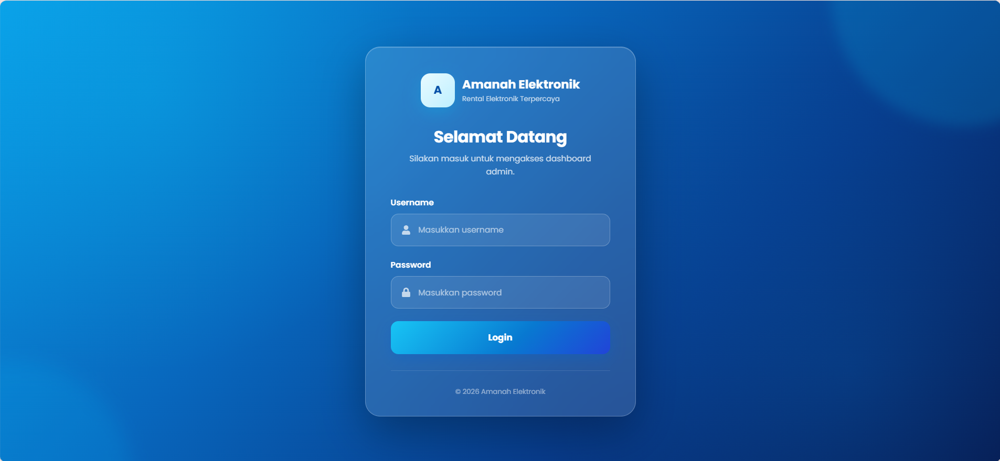
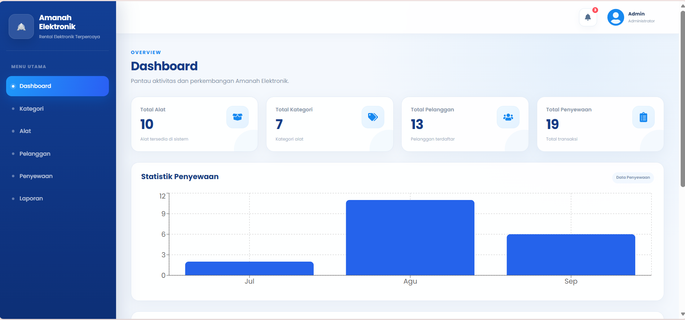
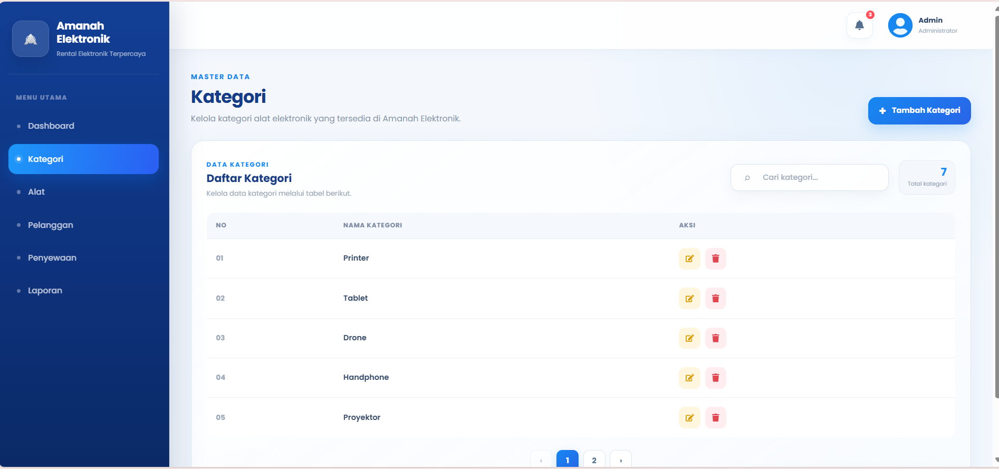
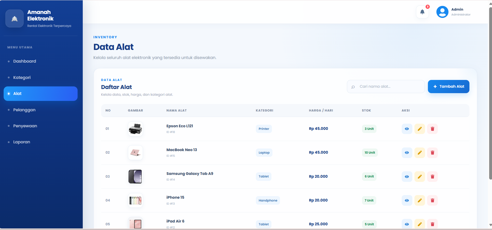
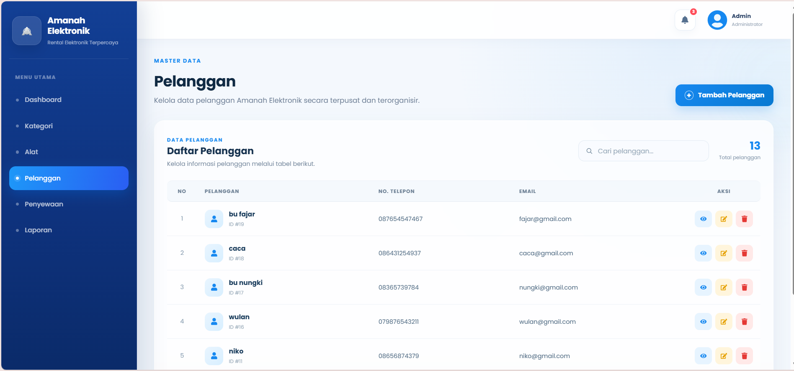
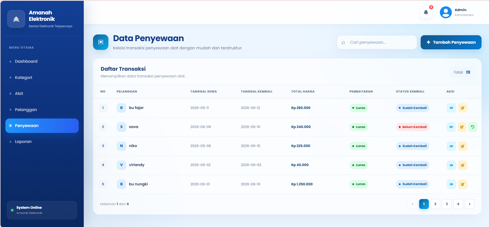
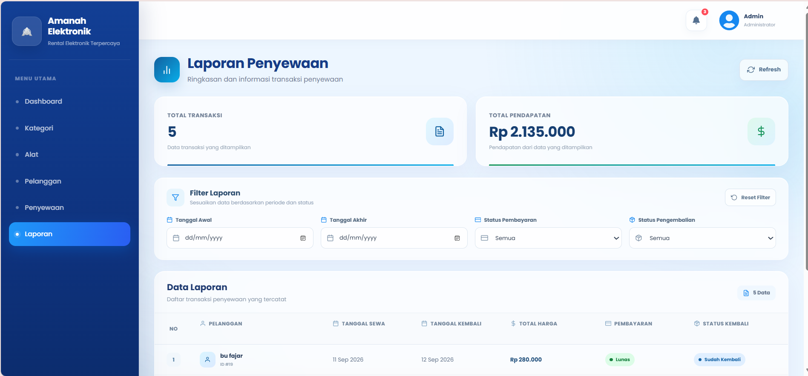

# Amanah Elektronik — Admin Web

Dashboard administrasi berbasis web untuk sistem penyewaan perangkat elektronik.

## Tentang

Aplikasi ini digunakan oleh admin Amanah Elektronik untuk mengelola operasional penyewaan, mulai dari data alat hingga transaksi dan pengembalian.

## Fitur

* Login Admin
* Dashboard Statistik
* Manajemen Kategori
* Manajemen Alat
* Manajemen Pelanggan
* Manajemen Penyewaan
* Pengembalian Alat
* Laporan

## Teknologi

* React.js
* JavaScript
* CSS
* RESTful API
* Axios
* Recharts
* JWT Authentication

## Tampilan

### Login Admin

### Dashboard

### Manajemen Kategori

### Manajemen Alat

### Manajemen Pelanggan

### Manajemen Penyewaan

### Laporan

## Backend

Aplikasi ini menggunakan REST API dari:

**Amanah Elektronik API — Laravel**

## Peran Saya

* Mengembangkan antarmuka admin menggunakan React.js.
* Membuat reusable components.
* Mengintegrasikan REST API.
* Mengelola autentikasi menggunakan JWT.
* Mengembangkan halaman dashboard, alat, pelanggan, penyewaan, dan laporan.
* Melakukan pengujian integrasi API.

## Catatan

Project ini merupakan bagian dari sistem **Amanah Elektronik Rental Management System**.
